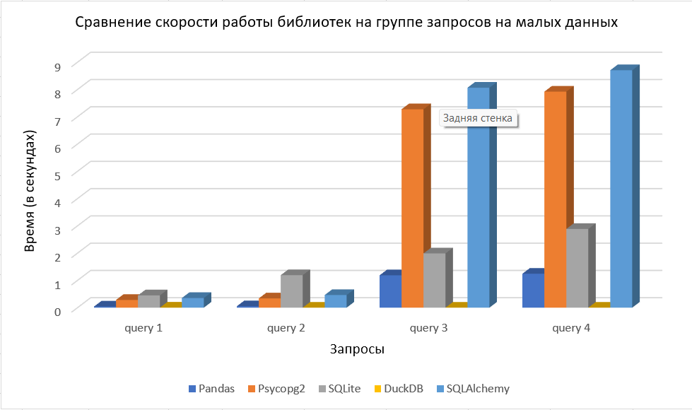
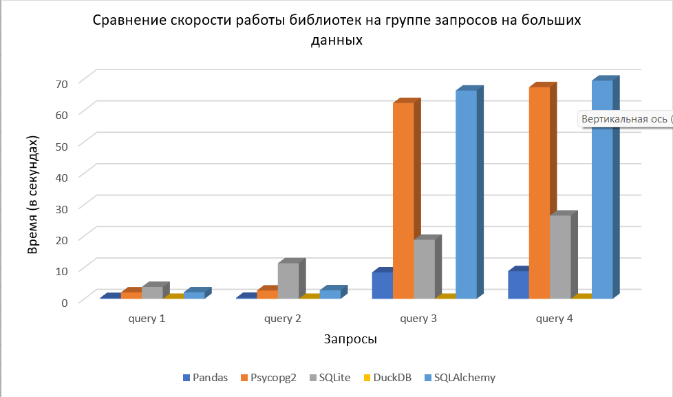

# Бенчмарк python библиотек для работы с базами данных

## Оглавление

  - [1. О бенчмарке](#1-о-бенчмарке)
  - [2. Конфиг файл](#2-конфиг-файл)
  - [3. Запуск бенчмарка](#3-запуск-бенчмарка)
  - [4. Результаты замеров времени на разных данных](#4-результаты-замеров-времени-на-разных-данных)
    - [Tiny (200 Mb)](#tiny-200-mb)
    - [Big (2 Gb)](#big-2-gb)
  - [5. Выводы о работе библиотек](#5-выводы-о-работе-библиотек)
    - [5.1. Pandas](#51-pandas)
    - [5.2. Psycopg2](#52-psycopg2)
    - [5.3. SQLite](#53-sqlite)
    - [5.4. DuckDB](#54-duckdb)
    - [5.5. SQLAlchemy](#55-sqlalchemy)

## 1. О бенчмарке

Данный бенчмарк представляет собой замеры среднего времени выполнения четырех запросов на нескольких python библиотеках для работы с базами данных. Для теста доступно пять библиотек:
- Pandas
- Psycopg2
- SQLite
- DuckDB
- SQLAlchemy

Поведение программы настраивается с помощью файла [config.json](./config.json).

## 2. Конфиг файл

В конфигурационном файле заданы ```8``` переменных, которые определяют поведение программы:
- tests_count - количество запусков каждого запроса, по умолчанию установлено значение ```50``` для получения медианного времени выполнения запроса.
- path_to_file - путь к файлу с датасетом.
- postgres_password - пароль к postgres, где создается таблица.
- pandas, psycopg2, sqlite, duckdb, sqlalchemy - переменные формата ```{<module_name>: true/false, ...}```, указывающие на библиотеки для запуска запросов. ```true``` - модуль будет запущен, ```false``` - модуль не будет запущен.

## 3. Запуск бенчмарка
Для запуска бенчмарка необходимо:
1. Настроить конфигурационный файл по своему предпочтению
2. Создать виртуальное окружение, например, с помощью ```venv```, прописав команду ```python -m venv /path/to/new/virtual/environment```
3. В этом виртуальном окружении установить зависимости командой ```pip install .```
4. Запустить сам бенчмарк, открыв папку с бенчмарком в консоли и прописав команду ```python main.py```

> [!CAUTION]
> Данный бенчмарк не работает с Python версии 3.12

## 4. Результаты замеров времени на разных данных

Ниже в виде таблиц приведены результаты замеров времени выполнения запросов из бенчмарка ```4queries``` и таблицы ```trips```. После них представлены графики сравнения времени выполнения всех четырех запросов с помощью пяти разных библиотек. Были использованы две версии датасета.

### Tiny (200 Mb)

|         | Pandas     | Psycopg2   | SQLite     | DuckDB     | SQLAlchemy |
| ------- | ---------- | ---------- | ---------- | ---------- | ---------- |
| Query 1 | 0,04088906 | 0,28231881 | 0,45070112 | 0,00062113 | 0,35460229 |
| Query 2 | 0,05175608 | 0,33915804 | 1,19165046 | 7,95E-05   | 0,46270098 |
| Query 3 | 1,18676007 | 7,27459382 | 1,98864394 | 0,00012162 | 8,06487517 |
| Query 4 | 1,24407888 | 7,92013889 | 2,8861945  | 0,00012855 | 8,70600884 |



### Big (2 Gb)

|         | Pandas     | Psycopg2   | SQLite     | DuckDB     | SQLAlchemy |
| ------- | ---------- | ---------- | ---------- | ---------- | ---------- |
| Query 1 | 0,27131656 | 2,04692046 | 3,79705908 | 0,00055157 | 2,0815309  |
| Query 2 | 0,32516972 | 2,66203217 | 11,330064  | 0,00014451 | 2,72419165 |
| Query 3 | 8,42383714 | 62,3303261 | 18,7934904 | 0,00018131 | 66,284305  |
| Query 4 | 8,800173   | 67,3591592 | 26,4893619 | 0,00018789 | 69,4389735 |



## 5. Выводы о работе библиотек

### 5.1. Pandas

Библиотека Pandas расположилась на втором месте по эффективности. Все запросы 
выполнились в пределах 10 секунд на обоих размерах датасета. Интерфейс библиотеки
позволял выбирать данные без необходимости писать SQL запросы, что позитивно
сказалось на developer experience.

### 5.2. Psycopg2

Поддерживает отправку SQL запросов из кода. С использованием Psycopg2 третий
и четвертый запросы выполнялись дольше минуты на большом датасете, при этом
время выполнения первого и второго запросов меньше, чем у SQLite. Библиотека
является базовой оберткой для работы с postgres, не предоставляет функционала
для работы с данными. Такая низкая производительность связана с однопоточностью
запросов.

### 5.3. SQLite

SQLite - не самый плохой выбор, поддерживает отправку SQL запросов из  кода.
С увеличением сложности запроса время выполнения
растет довольно постепенно как на малых, так и на больших данных. Было замечено,
что SQLite потреблял наибольшее количество ОЗУ среди всех библиотек, соответственно,
это негативно повлияло на его производительность. Демонстрирует наихудшее время
на первых двух запросах при обоих размерах датасета.

### 5.4. DuckDB

DuckDB - гвоздь сегодняшней программы. Все четыре запроса выполняются быстрее
всего именно с использованием этой библиотеки. Все запросы выполнились быстрее,
чем за секунду, несмотря на размер датасета. Ядро библиотеки написано на плюсах,
благодаря чему максимально эффективно используются и память, и процессорное время.

### 5.5. SQLAlchemy

Библиотека требует создание класса модели и предоставляет удобный интерфейс
для разработчика. SQLAlchemy зависит от Psycopg2, которая используется в
качестве движка для выполнения SQL запросов postgresql. Сравнение производительности
SQLAlchemy с Psycopg2 показывают, что увеличение времени исполнения невелико.
Производительность этой библиотеки сильно ограничена производительностью ее
движка (Psycopg2), поэтому она демонстрирует наихудшее время
среди всех пяти библиотек.


